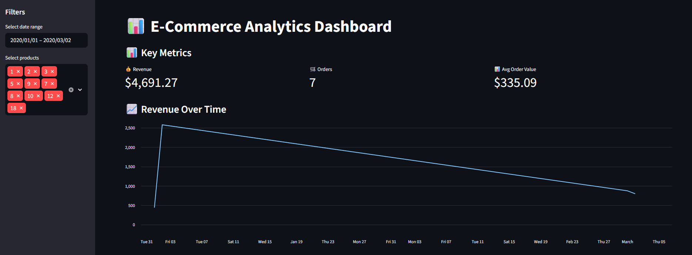
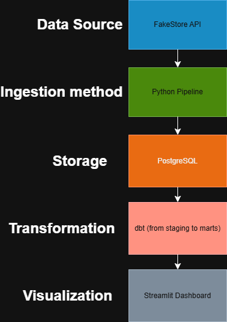
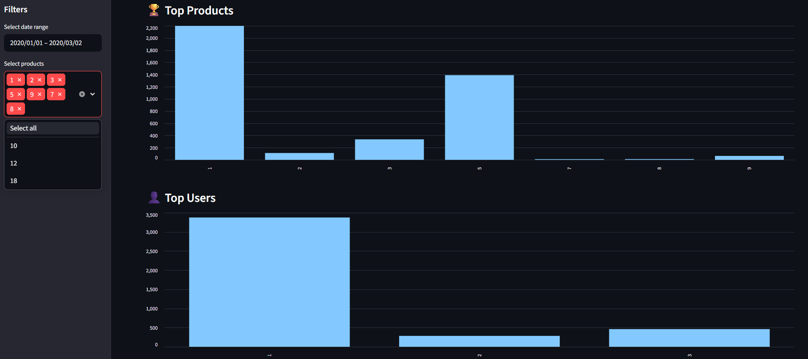

# 🚀 Modern Data Warehouse Project (End-to-End ELT Pipeline)

## 📌 Overview

This project demonstrates the design and implementation of a **modern, end-to-end data warehouse pipeline** using an open-source stack.

It covers the full data lifecycle:

* **Data ingestion** from external APIs
* **Data storage** in a relational warehouse
* **Transformation & modeling** using dbt
* **Data quality testing**
* **Interactive analytics dashboard**

The goal is to simulate a **real-world production data platform** using industry-standard tools.



---

## 🧱 Architecture



---

## ⚙️ Tech Stack

| Layer           | Tool                                    |
| --------------- | --------------------------------------- |
| Ingestion       | Python (requests, psycopg2)             |
| Orchestration   | Modular Python pipeline (Airflow-ready) |
| Data Warehouse  | PostgreSQL (Dockerized)                 |
| Transformations | dbt (Dockerized)                        |
| Data Modeling   | Star Schema (Fact & Dimensions)         |
| Data Quality    | dbt tests                               |
| Visualization   | Streamlit                               |
| Environment     | Docker + Virtual Environment            |

---

## 📥 Data Source

Data is ingested from the **FakeStore API**, simulating an e-commerce platform:

* Products
* Users
* Carts (nested → flattened into transactional data)

---

## 🔄 Pipeline Design

### 1. Ingestion Layer (Python)

* Modular pipeline structure
* API data extraction
* Flattening of nested JSON (cart → product-level granularity)
* Idempotent loading using `ON CONFLICT`
* Handles schema evolution

---

### 2. Data Warehouse (PostgreSQL)

Raw tables:

* `raw_products`
* `raw_users`
* `raw_carts` *(flattened)*

---

### 3. Transformation Layer (dbt)

#### 🟡 Staging Layer

* `stg_products`
* `stg_users`
* `stg_carts`

Purpose:

* Clean and standardize raw data
* Rename columns
* Prepare for modeling

---

#### 🟢 Mart Layer (Star Schema)

* `dim_products`
* `dim_users`
* `fact_cart_items` 💰

---

## ⭐ Star Schema Design

### Fact Table: `fact_cart_items`

| Column      | Description                           |
| ----------- | ------------------------------------- |
| cart_id     | Order identifier                      |
| user_id     | Customer                              |
| product_id  | Product                               |
| quantity    | Units purchased                       |
| price       | Unit price                            |
| total_value | **Derived metric (price × quantity)** |
| date        | Transaction date                      |

---

### Dimensions

* `dim_products` → product attributes
* `dim_users` → customer attributes

---

## 📊 Data Quality

Implemented using **dbt tests**:

* `NOT NULL` constraints
* `UNIQUE` constraints

Ensures:

* Data integrity
* Reliable analytics

---

## 📈 Dashboard (Streamlit)


The dashboard has the intention to answer the following points:
* What is the total revenue over time?
* Which products generate the most revenue?
* Who are the top customers?
* How does sales evolver over time?

It also contains features such as:
* Dynamic filtering
* Real-time KPI Updates
* Interactive charts

### Filters in Action

---

## 🧠 Key Concepts Demonstrated

* ELT pipeline design
* Dockerized data stack
* API ingestion & JSON flattening
* Data warehouse modeling (Star Schema)
* dbt transformations & testing
* Handling schema evolution & dependencies
* Building analytics-ready datasets
* Delivering insights through dashboards

---

## 🚀 How to Run the Project

### 1. Clone repository

```bash
git clone https://github.com/MarcoABarrera/Modern-Data-Warehouse.git
cd Modern-Data-Warehouse
```

### 2. Start services

```bash
docker compose up -d
```

### 3. Run ingestion pipeline

```bash
python scripts/ingestion/main.py
```

### 4. Run dbt models

```bash
docker compose run dbt run
docker compose run dbt test
```

### 5. Launch dashboard

```bash
streamlit run dashboard/app.py
```

---

## 📌 Project Highlights

* Fully **containerized data platform**
* Clean **modular architecture**
* Realistic **business use-case (e-commerce)**
* End-to-end **data → insights pipeline**
* Production-inspired design

---

## 🎯 What This Project Shows

This project demonstrates the ability to:

* Build scalable data pipelines
* Design analytical data models
* Work with modern data stack tools
* Deliver business insights from raw data

---

## 📬 Contact

**Marco Antonio Barrera Salas**

* LinkedIn: https://www.linkedin.com/in/marcobarrera98/
* GitHub: https://github.com/MarcoABarrera

---

⭐ If you found this project interesting, feel free to star the repo!
